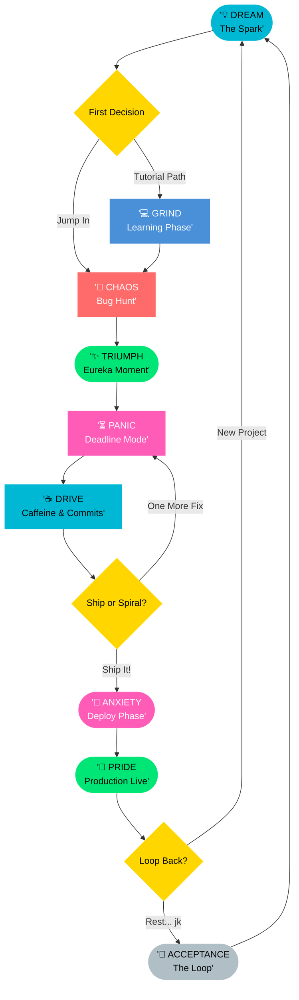

# Frontend Odyssey — The Developer's Journey 🚀

> *A humorous, scroll-driven interactive story about the life of a developer — from writing the first `<html>` tag to surviving production at 2 AM.*

**Theme 5 · IIT Frontend Hackathon Submission**

---

## 🌐 Live Experience

| Link | Purpose |
|------|---------|
| [🔗 Live Site](https://frontend-odyssey-the-interactive-we.vercel.app/) | Main production build |
| [🐛 Debug Mode](https://frontend-odyssey-the-interactive-we.vercel.app/?debug=true) | Enables visual debug grid and system overlays |

---

## 📖 Project Description

*"The Life of a Developer"* is a humorous, scroll-driven interactive story that follows Alex Chen — a junior full-stack engineer — through every phase a real developer lives through: the naïve excitement of writing a first Hello World, the spiral of tutorial hell, the chaos of hunting mysterious bugs, the eureka moment of clean code, the adrenaline of a pending deadline, the caffeine-fuelled grind, the anxiety of hitting Deploy, the quiet pride of a live product, and finally the acceptance that the loop never ends.

The experience is structured as 9 full-screen chapters, each with a distinct emotional mood, color palette, and interactive element. GSAP with ScrollTrigger powers cinematic scroll transitions: a pinned IDE panel in the Learning chapter, parallax backgrounds, staggered milestone reveals, scroll-scrubbed progress, and scroll-linked background color shifts that physically represent the developer’s emotional state. Every chapter has something to *do* — squash physics-based bugs on a canvas, brew coffee and watch the page react to caffeine level, drag a rubber duck over legacy code to debug it, or hit the giant SHIP IT button and watch a 400-particle confetti engine celebrate the deploy.

Accessibility is first-class: all interactions are keyboard-navigable, an `aria-live` narrator region announces every chapter transition and mini-game result, a manual Motion toggle serves users with vestibular disorders, and focus is managed correctly for every overlay and modal. The design system uses CSS custom properties, fluid `clamp()` typography, and a mobile-first responsive layout that works from 320 px to 1920 px.

---

## ✨ Story Flow — The Developer’s Arc



---

## 🎮 Key Features

- **Scroll Storytelling** — GSAP ScrollTrigger with pinned scenes, parallax layers, scrubbed progress bar, and scroll-linked chapter navigation dots
- **Physics Bug Mini-Game** — Canvas-rendered bugs with realistic movement; squash them by click/tap or keyboard (`SMASH_NEXT` / `AUTO_CLEAN`)
- **Rubber Duck Debugger** — Drag the duck over legacy code in the Eureka section to reveal the fix; keyboard-accessible via `ASK RUBBER DUCK`
- **Caffeine Global Feedback** — Changing caffeine level shifts background vignette and mentor commentary for the entire page
- **Confetti Deploy Engine** — 400-particle physics engine fires on ship
- **Emotional Aura Backgrounds** — Generative radial gradient layers shift hue per chapter (blue → yellow → red → green → neutral)
- **Mentor Terminal** — Type `mentor` or `help` anywhere on the keyboard to summon senior dev wisdom
- **Konami Code Easter Egg** — `↑↑↓↓←→←→BA` triggers full INSANE MODE
- **Journey Persistence** — Caffeine level, Zen Mode, and narrative preferences saved via `localStorage`

---

## ♿ Accessibility

- **WCAG AA Compliant** — 4.5:1+ contrast ratios across all interactive states
- **`aria-live` Narrator** — Announces every chapter transition and mini-game outcome for screen reader users
- **Full Keyboard Parity** — Every mini-game, toggle, and CTA reachable via `Tab` / `Enter` / `Space` / Arrow keys
- **Manual Motion Toggle** — Disables decorative GSAP animations independently of OS `prefers-reduced-motion`
- **Focus Management** — All overlays (bug success, mentor dialog) trap and restore focus correctly
- **`aria-hidden` Decoratives** — All emoji/icon decorations are hidden from the accessibility tree

---

## 🛠️ Tech Stack

| Layer | Technology |
|-------|-----------|
| Framework | React 18 + Vite 6 |
| Animation | GSAP 3 (ScrollTrigger, TextPlugin, ScrollToPlugin) |
| Canvas | Vanilla Canvas 2D API |
| Styling | Plain CSS with custom properties + fluid `clamp()` |
| Typography | Outfit + JetBrains Mono (Google Fonts) |
| Deployment | Vercel |

---

## 📁 Project Structure

```
src/
├── components/
│   ├── AuraBackground.jsx        # Generative mood-linked background
│   ├── BugsSection.jsx           # Canvas bug mini-game
│   ├── CaffeineCommitsSection.jsx
│   ├── ControlDock.jsx           # Floating control system (Voice, Zen, Motion)
│   ├── DeadlineSection.jsx
│   ├── EurekaSection.jsx         # Rubber duck debugger
│   ├── HeroSection.jsx
│   ├── LearningPhase.jsx         # Pinned IDE + milestone scrollytelling
│   ├── LoopSection.jsx
│   ├── ProductionDeployedSection.jsx
│   └── ShippingPhaseSection.jsx
├── content/
│   ├── devLifeStory.js           # All narrative copy centralized
│   └── narrationMessages.js      # Screen reader narration strings
├── hooks/
│   ├── useFocusRestore.js        # Focus trap/restore for overlays
│   ├── useNarrator.js            # aria-live announce helper
│   └── useNavigation.js          # Keyboard + gesture navigation
├── utils/
│   └── shortcuts.js              # Konami, ESC, URL param handlers
├── App.jsx
├── App.css
└── index.css
```

---

## 🚀 Run Locally

```bash
git clone https://github.com/ayushjhaa1187-spec/Frontend-Odyssey-The-Interactive-Web-Experience.git
cd Frontend-Odyssey-The-Interactive-Web-Experience
npm install
npm run dev
```

Production build:

```bash
npm run build
npm run preview
```

---

## 🔑 Keyboard Shortcuts

| Key | Action |
|-----|--------|
| `1` – `9` | Jump directly to any chapter |
| `PageDown` / `PageUp` | Navigate to next / previous chapter |
| Type `mentor` or `help` | Open Mentor Terminal |
| `↑↑↓↓←→←→BA` (Konami Code) | Activate INSANE MODE |
| `Esc` | Exit all special modes |

---

*Built with passion, caffeine, and exactly one rubber duck 🐤*
