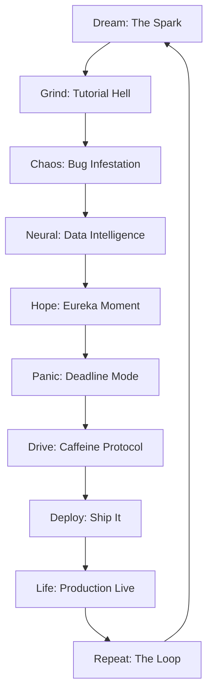

# Frontend Odyssey

[](https://frontend-odyssey-the-interactive-we.vercel.app/)
[](https://react.dev/)
[](https://vite.dev/)
[](https://greensock.com/gsap/)
[](LICENSE)

An interactive, scroll-driven web experience that follows **Alex Chen** -- a junior full-stack engineer -- through the ten emotional phases every developer lives through: the spark of writing Hello World, the spiral of tutorial hell, hunting mysterious bugs, the eureka of clean code, deadline panic, caffeine-fueled commits, the anxiety of deploying, the pride of a live product, and the acceptance that the loop never ends.

Each phase is a full-screen chapter with its own color palette, interactive element, and GSAP-powered animation. Squash physics-based bugs on a canvas, drag a rubber duck to debug legacy code, crank a caffeine meter that shakes the entire page, or hit the giant SHIP IT button and watch a rocket launch with confetti.

**Live**: [frontend-odyssey-the-interactive-we.vercel.app](https://frontend-odyssey-the-interactive-we.vercel.app/)

---

## Features

**Storytelling Engine**
- 10 scroll-driven chapters with distinct emotional arcs and dynamic background colors
- GSAP ScrollTrigger with pinned scenes, parallax layers, and scrubbed progress
- Emotional color system that shifts the entire palette per chapter

**Interactive Elements**
- Canvas bug-squash mini-game with physics-based movement and mouse repulsion
- Rubber duck debugger: drag the duck over legacy code to reveal the fix
- Caffeine meter with four levels that affect the entire page aesthetic
- Ship-it deploy button with rocket launch and terminal log simulation
- Branching narrative choices in the Eureka section

**UI System**
- Light and dark themes with persistent preference via localStorage
- Sticky navbar with section navigation, mobile hamburger menu, and theme toggle
- AI storytelling assistant chat widget (Odyssey Guide) with context-aware responses
- Error boundary with graceful fallback UI
- Skeleton loading component

**Accessibility (WCAG AA)**
- `aria-live` narrator announces every chapter transition and game outcome
- Full keyboard navigation: Tab, Enter, Space, Arrow keys, number keys 1-9
- Manual motion toggle independent of OS `prefers-reduced-motion`
- Focus management with trap and restore for all overlays
- `aria-hidden` on all decorative elements

**Easter Eggs**
- Konami code (`Up Up Down Down Left Right Left Right B A`) activates INSANE MODE
- Type `mentor` or `help` anywhere for senior developer wisdom
- Debug mode via `?debug=true` URL parameter
- Legend mode unlocks after visiting all 10 sections

---

## Story Flow



---

## Tech Stack

| Layer | Technology |
|-------|-----------|
| Framework | React 19 + Vite 8 |
| Animation | GSAP 3 (ScrollTrigger, TextPlugin, ScrollToPlugin) |
| Canvas | Vanilla Canvas 2D API |
| Styling | CSS custom properties, fluid clamp() typography, light/dark themes |
| Typography | Space Grotesk + JetBrains Mono (Google Fonts) |
| Deployment | Vercel |

---

## Project Structure

```
src/
├── components/
│   ├── AuraBackground.jsx          # Generative mood-linked background
│   ├── BugsSection.jsx             # Canvas bug-squash mini-game
│   ├── CaffeineCommitsSection.jsx  # Caffeine meter + commit feed
│   ├── ChatWidget.jsx              # AI storytelling assistant
│   ├── ControlDock.jsx             # Voice, Zen, Motion toggles
│   ├── DeadlineSection.jsx         # Pinned deadline countdown
│   ├── ErrorBoundary.jsx           # Graceful error fallback
│   ├── EurekaSection.jsx           # Rubber duck debugger
│   ├── Footer.jsx                  # Site footer
│   ├── HeroSection.jsx             # Opening parallax scene
│   ├── LearningPhase.jsx           # Pinned IDE + milestones
│   ├── LoadingSkeleton.jsx         # Skeleton loading state
│   ├── LoopSection.jsx             # Final loop + credits
│   ├── Navbar.jsx                  # Sticky navigation bar
│   ├── NeuralLabSection.jsx        # Neural network visualization
│   ├── ProductionDeployedSection.jsx
│   └── ShippingPhaseSection.jsx    # Deploy terminal + rocket
├── content/
│   ├── devLifeStory.js             # All narrative copy
│   └── narrationMessages.js        # Screen reader narration
├── hooks/
│   ├── useFocusRestore.js          # Focus trap/restore
│   ├── useNarrator.js              # Web Speech API
│   └── useNavigation.js            # Keyboard + gesture nav
├── utils/
│   ├── shortcuts.js                # Konami code + URL params
│   └── storage.js                  # Safe localStorage wrapper
├── App.jsx                         # Main orchestrator
├── App.css                         # Component styles
└── index.css                       # Design system + themes
```

---

## Setup

```bash
git clone <repository-url>
cd Frontend-Odyssey-The-Interactive-Web-Experience
npm install
npm run dev
```

**Production build:**

```bash
npm run build
npm run preview
```

---

## Environment Variables

No environment variables are required. The app runs entirely client-side. See `.env.example` for reference.

---

## Keyboard Shortcuts

| Key | Action |
|-----|--------|
| `1` - `9` | Jump to chapter |
| `PageDown` / `PageUp` | Next / previous chapter |
| `Home` / `End` | First / last chapter |
| Type `mentor` or `help` | Open mentor terminal |
| Konami code | Activate INSANE MODE |
| `Esc` | Exit special modes |

---

Built by **Ayush Kumar Jha**.
